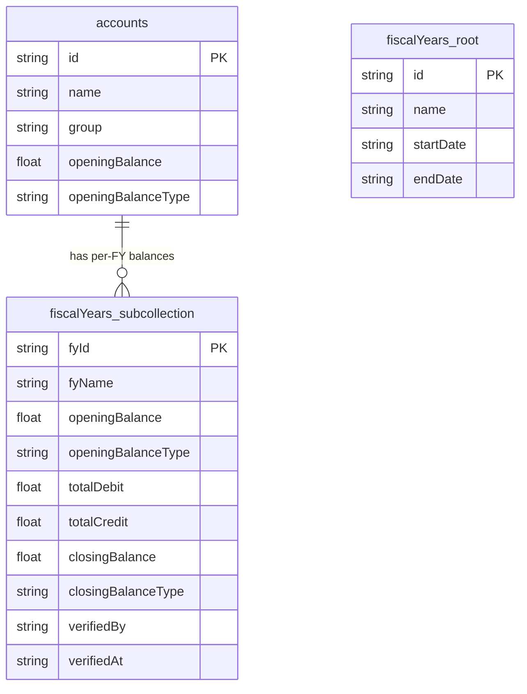
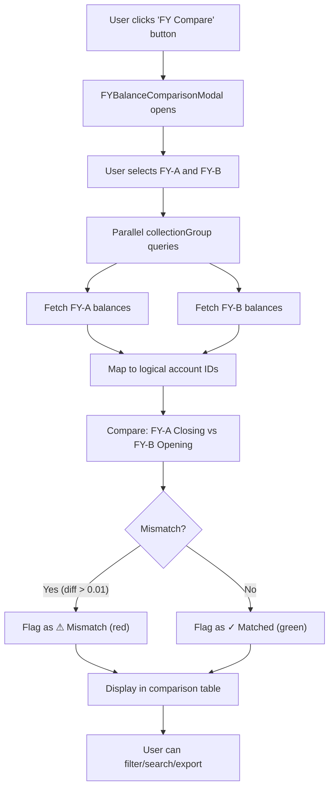

# FY-wise Opening/Closing Balance Comparison Tool

## Goal
AccountsTab mein ek naya **"FY Balance Comparison"** feature banana hai jo:
- Multiple Fiscal Years ke Opening Balance, Closing Balance, Total Debit, Total Credit ko **side-by-side** compare kare
- **Previous FY ki Closing Balance vs Current FY ki Opening Balance** ka difference highlight kare (continuity check)
- Mismatches ko **visually flag** kare (red highlight) taaki discrepancies aasani se dikhe
- Summary stats dikhe (total accounts with mismatches, total mismatch amount)
- Excel export support ho

## Background Context

### Current Data Architecture



- **Accounts** collection mein har account ka document hai
- Har account ke under `fiscalYears` subcollection hai jisme per-FY data stored hai: `openingBalance`, `openingBalanceType`, `totalDebit`, `totalCredit`, `closingBalance`, `closingBalanceType`
- Root `fiscalYears` collection mein FY metadata hai: `name`, `startDate`, `endDate`

### Key Insight for Continuity Check
**FY1 ki Closing Balance = FY2 ki Opening Balance honi chahiye** (accounting continuity rule). Agar ye match nahi karta, toh data mein discrepancy hai.

## Resolved Decisions

> [!TIP]
> **Feature Placement** ✅: Button **sabhi users** ko dikhega (no admin restriction). AccountsTab toolbar mein "📊 FY Compare" button hoga jo full-screen modal kholega.

> [!TIP]
> **FY Selection** ✅: Default **2 FYs** compare hongi (current FY + previous FY). User ko **"+ Add FY"** button milega jisse dynamically aur FYs add kar sake comparison mein (3, 4, 5... jitne chahiye). Har added FY ka ek dropdown + remove (✕) button hoga.

> [!TIP]
> **Signed Balance (Dr/Cr) Comparison** ✅: Dr/Cr type **exact match** hona zaroori hai. FY1 closing = 5000 Dr aur FY2 opening = 5000 Cr → **10000 ka mismatch** (signed difference). Yeh bahut important hai aur exactly aise hi implement hoga.

## Proposed Changes

### New Component: `FYBalanceComparisonModal.jsx`

#### [NEW] FYBalanceComparisonModal.jsx

Ek naya standalone modal component banayenge: `src/components/FYBalanceComparisonModal.jsx`

**Component Props:**
```jsx
FYBalanceComparisonModal({ 
    isOpen,          // boolean - modal visible ya nahi
    onClose,         // function - modal band karne ke liye
    allAccounts,     // array - saare accounts (already loaded in AccountsTab)
    fyOptions        // array - saare fiscal years
})
```

**Core Logic:**

1. **State Management:**
```jsx
// Default: current FY + previous FY (2 FYs)
// User can add more via "+ Add FY" button
const [selectedFYs, setSelectedFYs] = useState([]);  // Array of FY IDs, e.g. ['fy-2081-82', 'fy-2082-83']
const [fyBalancesMap, setFyBalancesMap] = useState({}); // { fyId: { accountId: balanceData } }
const [loading, setLoading] = useState(false);
const [searchQuery, setSearchQuery] = useState('');
const [filterType, setFilterType] = useState('all');  // 'all' | 'mismatch' | 'matched'
const [sortField, setSortField] = useState('name');
const [sortDir, setSortDir] = useState('asc');

// Initialize with last 2 FYs on mount
useEffect(() => {
    if (fyOptions.length >= 2) {
        setSelectedFYs([fyOptions[fyOptions.length - 2].id, fyOptions[fyOptions.length - 1].id]);
    } else if (fyOptions.length === 1) {
        setSelectedFYs([fyOptions[0].id]);
    }
}, [fyOptions]);

// Add/Remove FY handlers
const handleAddFY = () => {
    const availableFYs = fyOptions.filter(fy => !selectedFYs.includes(fy.id));
    if (availableFYs.length > 0) {
        setSelectedFYs(prev => [...prev, availableFYs[0].id]);
    }
};
const handleRemoveFY = (index) => {
    if (selectedFYs.length <= 2) return; // Minimum 2 FYs
    setSelectedFYs(prev => prev.filter((_, i) => i !== index));
};
const handleChangeFY = (index, newFyId) => {
    setSelectedFYs(prev => prev.map((fy, i) => i === index ? newFyId : fy));
};
```

2. **Data Fetching** (sabhi selected FYs ka data parallel fetch):
```jsx
useEffect(() => {
    if (!isOpen || selectedFYs.length < 2) return;
    
    const fetchAllFYs = async () => {
        setLoading(true);
        try {
            // Map to logical account IDs (same merging logic as AccountsTab)
            const accountDocIdToLogicalId = {};
            allAccounts.forEach(acc => {
                const ids = acc.allDocIds?.length > 0 ? acc.allDocIds : [acc.id];
                ids.forEach(id => { accountDocIdToLogicalId[id] = acc.id; });
            });
            
            // Parallel fetch for ALL selected FYs
            const snapshots = await Promise.all(
                selectedFYs.map(fyId =>
                    getDocs(query(collectionGroup(db, 'fiscalYears'), where('fyId', '==', fyId)))
                )
            );
            
            // Build balances map: { fyId: { logicalAccountId: balanceData } }
            const newBalancesMap = {};
            selectedFYs.forEach((fyId, index) => {
                const bal = {};
                snapshots[index].forEach(docSnap => {
                    const parentId = docSnap.ref.parent?.parent?.id;
                    const logicalId = parentId ? accountDocIdToLogicalId[parentId] : null;
                    if (logicalId && !bal[logicalId]) bal[logicalId] = docSnap.data();
                });
                newBalancesMap[fyId] = bal;
            });
            
            setFyBalancesMap(newBalancesMap);
        } catch (err) {
            console.error("Error fetching FY comparison data:", err);
        } finally {
            setLoading(false);
        }
    };
    fetchAllFYs();
}, [isOpen, selectedFYs, allAccounts]);
```

3. **Comparison Logic** (har account ke liye consecutive FY pairs ka signed difference):
```jsx
const comparisonData = useMemo(() => {
    // Collect all unique account IDs across all selected FYs
    const uniqueAccountIds = new Set();
    selectedFYs.forEach(fyId => {
        Object.keys(fyBalancesMap[fyId] || {}).forEach(id => uniqueAccountIds.add(id));
    });
    
    return Array.from(uniqueAccountIds).map(accId => {
        const acc = allAccounts.find(a => a.id === accId);
        
        // Per-FY data
        const fyData = {};
        selectedFYs.forEach(fyId => {
            const data = (fyBalancesMap[fyId] || {})[accId] || {};
            fyData[fyId] = {
                opening: data.openingBalance || 0,
                openingType: data.openingBalanceType || '',
                totalDebit: data.totalDebit || 0,
                totalCredit: data.totalCredit || 0,
                closing: data.closingBalance || 0,
                closingType: data.closingBalanceType || '',
                exists: !!(fyBalancesMap[fyId] || {})[accId],
            };
        });
        
        // Continuity checks between consecutive FY pairs
        // FY[0].closing vs FY[1].opening, FY[1].closing vs FY[2].opening, etc.
        const continuityChecks = [];
        for (let i = 0; i < selectedFYs.length - 1; i++) {
            const prevFY = fyData[selectedFYs[i]];
            const nextFY = fyData[selectedFYs[i + 1]];
            
            const closingSigned = (prevFY.closingType === 'Cr' ? -1 : 1) * prevFY.closing;
            const openingSigned = (nextFY.openingType === 'Cr' ? -1 : 1) * nextFY.opening;
            const diff = closingSigned - openingSigned;
            
            continuityChecks.push({
                pairLabel: `${selectedFYs[i]} → ${selectedFYs[i + 1]}`,
                diff: Math.abs(diff),
                diffType: diff > 0 ? 'Dr' : (diff < 0 ? 'Cr' : ''),
                hasMismatch: Math.abs(diff) > 0.01,
            });
        }
        
        const hasMismatch = continuityChecks.some(c => c.hasMismatch);
        const existsInAll = selectedFYs.every(fyId => fyData[fyId].exists);
        const existsInSome = selectedFYs.some(fyId => fyData[fyId].exists);
        
        return {
            accId,
            name: acc?.name || 'Unknown',
            group: acc?.group || '',
            fyData,
            continuityChecks,
            hasMismatch,
            existsInAll,
            missingInFYs: selectedFYs.filter(fyId => !fyData[fyId].exists),
        };
    });
}, [fyBalancesMap, selectedFYs, allAccounts]);
```

4. **Summary KPIs**:
```jsx
const summary = useMemo(() => {
    let totalAccounts = comparisonData.length;
    let mismatchCount = comparisonData.filter(d => d.hasMismatch).length;
    let matchedCount = totalAccounts - mismatchCount;
    let totalMismatchAmount = comparisonData
        .filter(d => d.hasMismatch)
        .reduce((sum, d) => sum + d.continuityChecks.reduce((s, c) => s + c.diff, 0), 0);
    let partialCount = comparisonData.filter(d => !d.existsInAll).length;
    
    return { totalAccounts, mismatchCount, matchedCount, 
             totalMismatchAmount, partialCount };
}, [comparisonData]);
```

**UI Layout** (dynamic columns based on selected FYs):

```
┌────────────────────────────────────────────────────────────────────────────────────┐
│  📊 FY Balance Comparison                                                     [X] │
├────────────────────────────────────────────────────────────────────────────────────┤
│  [FY ▼ 2080-81] [✕]  [FY ▼ 2081-82] [✕]  [FY ▼ 2082-83] [✕]   [+ Add FY]      │
│                                                              (min 2, remove ✕     │
│                                                               disabled at 2)      │
├────────────────────────────────────────────────────────────────────────────────────┤
│  ┌──────────┐  ┌──────────┐  ┌──────────┐  ┌──────────┐                          │
│  │ Total    │  │ Matched  │  │ Mismatch │  │ Partial  │                          │
│  │ Accounts │  │    ✓     │  │   ⚠      │  │ (not in  │                          │
│  │   350    │  │   340    │  │   10     │  │ all FYs) │                          │
│  └──────────┘  └──────────┘  └──────────┘  └──────────┘                          │
├────────────────────────────────────────────────────────────────────────────────────┤
│  [🔍 Search]  [Filter: All ▼]  [Export Excel 📥]                                 │
├────────┬──────────────────┬──────┬──────────────────┬──────┬──────────────────┬───┤
│        │   FY 2080-81     │ Diff │   FY 2081-82     │ Diff │   FY 2082-83     │   │
│ Account├─────┬─────┬──────┤  ①   ├─────┬─────┬──────┤  ②   ├─────┬─────┬──────┤   │
│  Name  │Open │Dr/Cr│Close │      │Open │Dr/Cr│Close │      │Open │Dr/Cr│Close │   │
├────────┼─────┼─────┼──────┼──────┼─────┼─────┼──────┼──────┼─────┼─────┼──────┤   │
│ ABC Co │5000 │2000/│8000  │ 0.00 │8000 │3000/│6000  │ 0.00 │6000 │1000/│7000  │   │
│        │ Dr  │1000 │ Dr   │  ✓   │ Dr  │5000 │ Cr   │  ✓   │ Cr  │4000 │ Cr   │   │
├────────┼─────┼─────┼──────┼──────┼─────┼─────┼──────┼──────┼─────┼─────┼──────┤   │
│ XYZ Ltd│3000 │500/ │2500  │500.00│2000 │1000/│4000  │ 0.00 │4000 │2000/│3000  │   │
│   🔴   │ Cr  │1000 │ Cr   │ ⚠ Dr │ Cr  │2000 │ Cr   │  ✓   │ Cr  │1000 │ Cr   │   │
└────────┴─────┴─────┴──────┴──────┴─────┴─────┴──────┴──────┴─────┴─────┴──────┘   │
│                                                                                    │
│  [◀ Prev]  Page 1 of 35  [Next ▶]                                                │
└────────────────────────────────────────────────────────────────────────────────────┘
```

> [!NOTE]
> Table dynamically N FY columns render karega with (N-1) Diff columns between consecutive pairs. Horizontal scroll hoga agar 3+ FYs select karein.

**Key Table Columns** (repeated per selected FY):
| Column | Description |
|--------|-------------|
| Account Name | Account name + group (below in gray) |
| FY-N Opening | Opening balance + type (Dr/Cr) for FY-N |
| FY-N Dr/Cr | Total Debit / Total Credit for FY-N |
| FY-N Closing | Closing balance + type for FY-N |
| **Diff ①②...** | **Previous FY Closing vs Next FY Opening** — ✓ green for match, ⚠ red for mismatch. One diff column between each consecutive pair. |

**Filter Options:**
- `all` — All accounts
- `mismatch` — Only accounts with at least one continuity mismatch across any FY pair
- `matched` — All continuity checks pass for all FY pairs
- `partial` — Accounts not present in all selected FYs

**Excel Export**: Comparison data ko Excel mein export karna with color-coded mismatch highlighting using `xlsx` library (already a dependency). Dynamic columns based on number of selected FYs.

**Mobile View**: Cards layout with collapsible FY data sections since side-by-side table won't fit on mobile screens.

---

### Modify: `AccountsTab.jsx`

#### [MODIFY] AccountsTab.jsx

**Changes required:**

1. **Import** the new modal component:
```jsx
import FYBalanceComparisonModal from './FYBalanceComparisonModal';
```

2. **Add state** for modal visibility:
```jsx
const [fyCompareModalOpen, setFyCompareModalOpen] = useState(false);
```

3. **Add button** in the toolbar (near the FY selector, after the Ignored Accounts button):
```jsx
<button
    type="button"
    onClick={() => setFyCompareModalOpen(true)}
    className="flex justify-center items-center gap-2 px-4 py-2 rounded-lg text-sm font-bold transition shadow-sm border bg-indigo-50 border-indigo-300 text-indigo-800 hover:bg-indigo-100"
>
    <Scale className="w-4 h-4" />
    <span>FY Compare</span>
</button>
```

4. **Render modal** at end of component:
```jsx
<FYBalanceComparisonModal
    isOpen={fyCompareModalOpen}
    onClose={() => setFyCompareModalOpen(false)}
    allAccounts={allAccounts}
    fyOptions={fyOptions}
/>
```

5. **Add `Scale` icon** to the lucide-react imports.

---

## Data Flow Diagram



## File Change Summary

| File | Action | Description |
|------|--------|-------------|
| `src/components/FYBalanceComparisonModal.jsx` | **NEW** | ~500 lines — full comparison modal with table, filters, KPIs, pagination, Excel export, mobile view |
| `src/components/AccountsTab.jsx` | **MODIFY** | ~15 lines — import, state, button, and modal render |

## Verification Plan

### Automated Tests
```bash
# Build verification — ensure no compile errors
npm run build

# Lint check
npm run lint
```

### Manual Verification
1. **Modal Opens**: AccountsTab mein "FY Compare" button **sabhi users** ko dikhna chahiye. Click karo → modal khulna chahiye
2. **Default FY Selection**: Modal khulne par default 2 FYs selected honi chahiye (current + previous)
3. **Add FY**: "+ Add FY" button se additional FY dropdown add hona chahiye
4. **Remove FY**: ✕ button se FY remove hona chahiye (minimum 2 FYs honi chahiye, 2 par ✕ disabled)
5. **Data Loading**: FY select/change karne par data load hona chahiye with loading spinner
6. **Continuity Check (Dr/Cr exact match)**: 
   - Agar FY-A closing = 5000 Dr aur FY-B opening = 5000 Dr → ✓ green (matched)
   - Agar FY-A closing = 5000 Dr aur FY-B opening = 3000 Dr → ⚠ red (2000 diff)
   - Agar FY-A closing = 5000 Dr aur FY-B opening = 5000 Cr → ⚠ red (**10000 diff** — Dr/Cr type mismatch, signed comparison)
7. **3+ FY Comparison**: 3 FYs select karo → 2 diff columns dikhne chahiye (FY1→FY2 and FY2→FY3)
8. **Filter**: "Mismatch Only" filter se sirf discrepancies dikhni chahiye (across any FY pair)
9. **Excel Export**: Excel file download hona chahiye with dynamic columns based on selected FYs
10. **Mobile**: Chhote screen par card view properly show hona chahiye
11. **Accounts not in all FYs**: Sirf kuch FYs mein present accounts correctly show hone chahiye with blank columns for missing FYs
